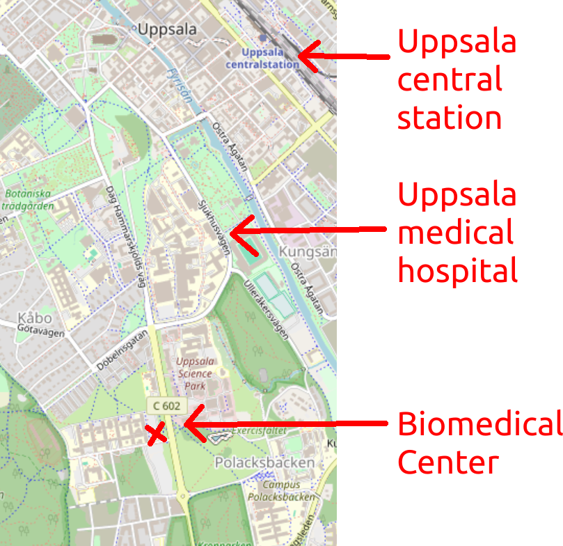
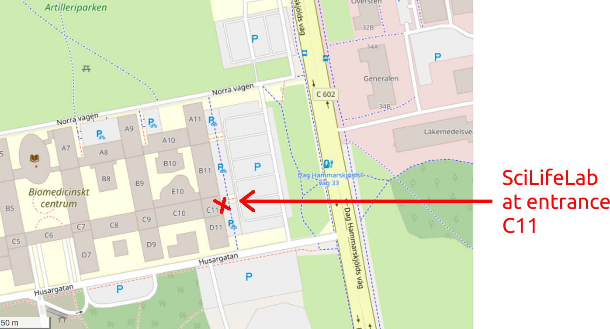

# prao_felix

PRAO of Felix.

## Location

We meet at the Biomedical Center in Uppsala at the Husargatan:

At BMC, we will meet at the SciLifeLab reception at the entrance at C11:

 * [OpenStreetMap](https://www.openstreetmap.org/search?query=bmc%2C%20uppsala#map=19/59.84188/17.63697)
 * [Meeting point](https://use.mazemap.com/#v=1&center=17.636962,59.841955&zoom=19.7&campusid=49&zlevel=1&sharepoitype=poi&sharepoi=1000459927)

At the SciLifeLab reception, wait in the comfy chairs,
until I pick you up and we go to my office.

 * [My office](https://use.mazemap.com/#v=1&zlevel=4&center=17.635980,59.841862&zoom=19.9&campusid=49&desttype=poi&dest=386656)

## Goal

Pick one:

 * [X] Find/write an example of well-written Python code 
   that shows a run-time speed bottleneck
   at an unexpected location.
   Adapt text at https://uppmax.github.io/programming_formalisms/optimisation/runtime_speed_profiles/
 * [ ] Do the exercises at https://uppmax.github.io/programming_formalisms/optimisation/big_o/ ,
   add these to the course materials
 * [ ] Finish the Programming Formalisms example project at https://github.com/programming-formalisms/programming_formalisms_example_project
 * [ ] Convert some private notes to documentation on how to
   transfer data to Swestore

## Schedule

Start|What
-----|-----
9:00 |Work: discuss, pick goal
10:00|Fika
10:15|Work
11:00|Break (R meeting, F is welcome)
11:15|Work (R meeting, F is welcome)
12:00|Lunch (or: work until 12:45, then break)
13:00|Work
14:00|Break
14:15|Work: deliver end product
15:15|Fika

## Learning route

- GitHub workflows: [here](https://uppmax.github.io/programming_formalisms/misc/github_workflow/)
- Python: [How to Think Like a Computer Scientist](https://openbookproject.net/thinkcs/python/english3e/index.html)

## Reflection

I think Felix was a great PRAO student.

What was great:

- Felix was great at working autonomously
- Felix felt comfortable enough to sometimes disagree
- We agreed on what needed to be done early
- Time schedule was clear

What could be improved:

- Zero of the four points were finished. This was partly by design:
  I wanted Felix to have the experience of incorrectly scheduling
  a project, i.e. I let him code the Python code first.
  I knew he should go from big to small, i.e. write the
  run-time profiling code first. 
  Maybe I should have pushed him more to do The Right Thing
- The evaluation at the end was rushed. 
  Next time, schedule 15 minutes and write this reflection together

In summary, I would recommend Felix to do a PRAO at any other place:
he did a good job!
